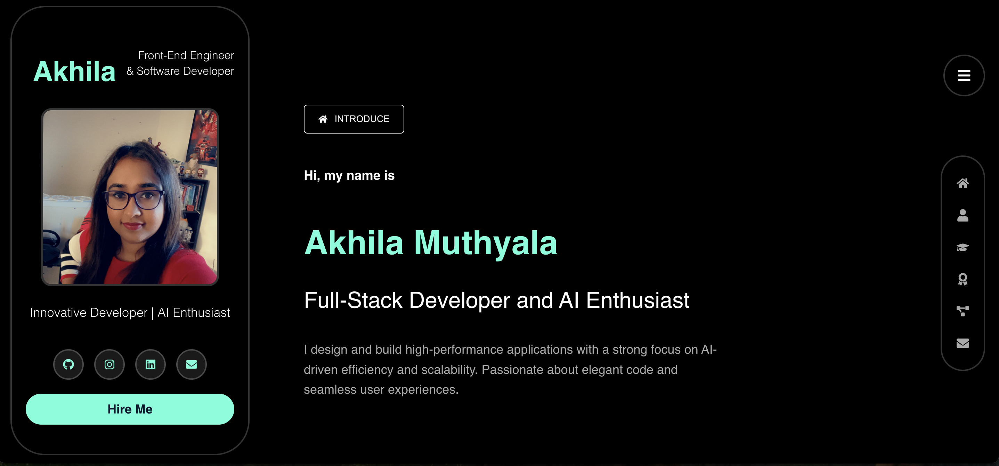

# 🚀 Akhila Muthyala – Developer Portfolio

https://amuthyal.github.io/v3-portfolio/

A fully responsive, modern portfolio website built with **React.js**, showcasing experience, projects, skills, certifications, and contact info — with smooth scroll-based transitions and a mobile-first design.

---

### ✨ Features

- 🎯 Full-screen scroll-based sections
- 🍔 Animated hamburger menu with sidebar navigation
- 📱 Fully responsive mobile view
- 🧭 Scroll snapping + active section tracking
- 🧾 Timeline for education & work history
- 🏆 Certification and project highlights
- 📩 Contact section and social links
- 🌙 Dark themed design with glowing neon highlights

---

### 🛠️ Tech Stack

| Frontend        | Tools & Libraries         | Deployment   |
|-----------------|---------------------------|--------------|
| React.js        | Framer Motion (animations)| GitHub Pages |
| HTML/CSS        | React Icons               | AWS S3 (optional) |
| JavaScript (ES6)| Intersection Observer API |              |

---

### 📂 Folder Structure

```
├── public/
│   └── index.html
├── src/
│   ├── assets/                # Images & media
│   ├── components/            # All React components
│   ├── styles/                # Component-based CSS
│   ├── App.js
│   ├── Home.js                # Main layout controller
│   └── index.js
├── README.md
└── package.json
```

---

### 📦 Installation & Setup

```bash
# 1. Clone the repository
git clone https://github.com/your-username/akhila-portfolio.git

# 2. Navigate to the project folder
cd akhila-portfolio

# 3. Install dependencies
npm install

# 4. Start the development server
npm start
```

---

### 📸 Preview

Desktop View:



Mobile View:


---

### ⚙️ Customization

Want to customize your own content?

Update the following:
- **IntroCard.js** – Name, avatar, role, and social links
- **TimelineSection.jsx** – Education & work data
- **Projects.js** – Your projects
- **Certifications.js** – List certifications and badges
- **Contact.js** – Contact message and call-to-action
- **Sidebar.js** – Adjust navigation links

---

### 🧑‍💻 Author

**Akhila Muthyala**  
Frontend & Full-Stack Developer  
[LinkedIn](https://www.linkedin.com/in/akhila-muthyala-48b776209/) | [GitHub](https://github.com/amuthyal)

---

### 📄 License

MIT License. Feel free to fork and personalize this portfolio for your own use.
